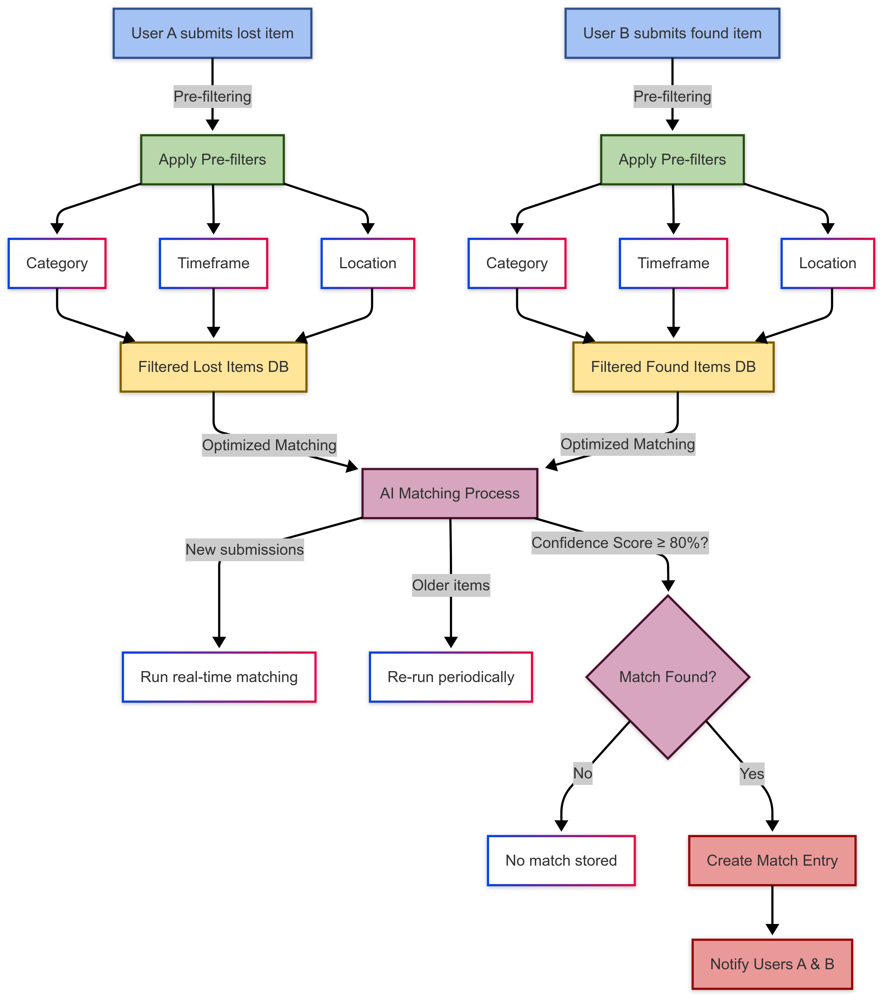

# Nemu



Nemu is an AI-powered lost and found platform that helps users recover lost items efficiently. Using advanced matching algorithms, Nemu reduces manual search efforts and increases item recovery rates.

## Table of Contents

- [Features](#features)
- [Installation](#installation)
- [Requirements](#requirements)
- [Getting Started](#getting-started)
- [Usage](#usage)
- [Contributing](#contributing)
- [License](#license)

## Features

- AI-driven lost and found item matching
- Pre-filtering based on category, timeframe, and location
- Real-time and periodic matching processes
- User notifications for matched items

## Installation

Clone the repository:

```bash
git clone https://github.com/drastraea/nemu.git
cd nemu
```

## Requirements

- Docker
- Node.js
- PostgreSQL (via Docker)

Start Docker:

```bash
npm run docker-up
```

Migrate the database:

```bash
npx prisma migrate dev --name init
```

## Getting Started

Install dependencies:

```bash
npm i
```

Run the development server:

```bash
npm run dev
```

Open [http://localhost:3000](http://localhost:3000) in your browser.

## Usage

Modify `app/page.js` to customize the application. Changes update automatically.

This project uses [`next/font`](https://nextjs.org/docs/app/building-your-application/optimizing/fonts) to optimize fonts, including [Geist](https://vercel.com/font).

## Contributing

Feel free to contribute by opening issues or submitting pull requests.

## License

This project is licensed under the MIT License.
